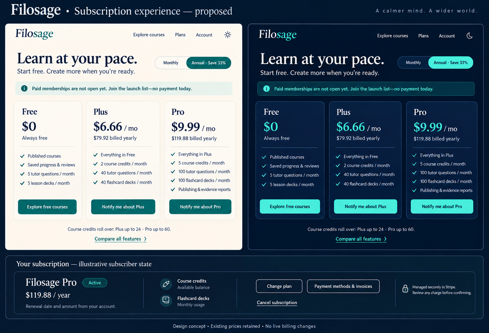

# Subscription UI review and proposed mockup

Status: proposal for Victor’s review; no production UI or billing configuration changed.

The image is a visual concept. The lower subscription panel is illustrative, not the current customer’s billing record. Final copy should read “5 lesson decks / month” on Free; the image contains a minor “lessons decks” typo. Keep the existing Filosage logo/tagline; the image’s decorative tagline is not proposed product copy.

## What was checked

Inspected the actual public pricing page, switched monthly/annual, and verified settled light/dark styles. Restored original dark/annual preferences. Monthly prices are Plus $9.99 and Pro $14.99. Annual prices are $79.92 and $119.88, shown as $6.66 and $9.99 monthly equivalents. Source review covered membership plans, billing readiness, checkout consent/reconciliation and subscription management UI. No purchase, cancellation, invoice access, email subscription or payment submission was performed. Signed-in billing lifecycle states were source-reviewed, not executed against a real subscription.

## Recommended changes

| Priority | Finding | Proposed behavior |
| --- | --- | --- |
| 1 | “Choose Pro” selects a preference while checkout is closed; the closure explanation is below the cards. | Put availability above the cards. While closed, use “Notify me about Plus/Pro” to open the existing consent flow, not silently enroll the user. When open, use explicit plan-selection CTAs and show checkout summary before consent. |
| 1 | Existing management actions sit below lengthy plan comparisons. | Add a dedicated current-subscription summary with actual plan, billing interval, renewal amount/date, status and obvious payment/invoice/cancel actions. Existing Stripe portal remains the execution surface. Never invent renewal data for granted/owner access. |
| 2 | Dense feature lists make comparison slow; Flashcards quotas are absent from the cards. | Use four or five differentiating benefits, explicitly show lesson/custom-deck allowances, then an expandable complete comparison. Keep Free custom-deck restrictions and all other plan rules. |
| 2 | Payment, cancellation and pending checkout states need a coherent visual hierarchy. | Past due: recovery CTA and access explanation. Cancellation scheduled: exact access-end date. Checkout pending: confirmation in progress and retry/support; never encourage duplicate checkout. Preserve backend eligibility and subscription locks. |
| 2 | Course-credit rules are repeated at length. | Give concise rollover limits beside the cards; keep full explanation one click away, including monthly grants on annual billing and twelve-month frozen credit retention. |

Preserve prices, allowances, refunds/eligibility policy and cancellation timing. Do not add trials, “most popular” claims, unsupported unlimited benefits or new billing activation. Notification consent stays explicit and unchecked. The existing privacy/Terms links and renewal disclosures remain available before any checkout. Mobile layout should stack cards with matching CTA order and keyboard-accessible interval selection; verify contrast, focus and status announcements during implementation.

## Product references

- [Notion pricing](https://www.notion.com/pricing): visible plan comparison and billing interval selection.
- [Todoist pricing](https://www.todoist.com/pricing/): concise tier differentiation and monthly/yearly comparison.
- [Todoist subscription management](https://www.todoist.com/help/todoist/billing/manage-your-todoist-pro-subscription-T4T0g9lb): discoverable management and cancellation routes.
- [Stripe customer portal](https://docs.stripe.com/customer-management): existing self-service payment methods, invoices and subscription management capabilities.

These are design references, not a claim that every product uses the same layout. The mockup is a proposed simplification of Filosage’s existing functionality.

## Remaining release check

The production and QA-retirement checks remain verified. Actual Microsoft-hosted light appearance still requires the user to set browser/system appearance to Light; automated browser settings access was blocked. App-selected theme synchronization remains unresolved. The pricing page’s working light toggle does not prove either hosted-auth requirement. R2 measurement limitations and retained QA-data disposition remain recorded in AGENT_PROGRESS.md.
