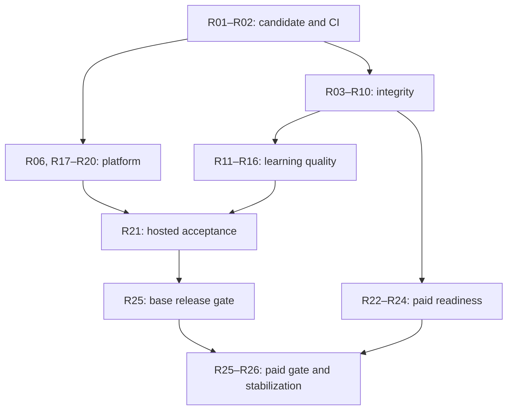

# FiloSage Release Implementation Plan

> **For agentic workers:** Use `superpowers:subagent-driven-development` or `superpowers:executing-plans` to implement this plan task by task. Preserve the complete outcome checklist, use isolated worktrees, and require an independent review of each meaningful change. This document authorizes planning; implementation, merge, deployment, production changes and paid activation remain distinct actions.

**Goal:** Take the existing FiloSage application through verified engineering, hosted operations, learner-experience and commercial release gates, preserving working code and completing the unfinished release branch.

**Architecture:** Retain the Next.js application, Azure Easy Auth identity boundary, PostgreSQL document store, Blob assets, server-owned AI generation and signed Stripe lifecycle. Harden identity-scoped state, transactional recovery and publication proofs inside those boundaries. Use bounded resumable operations and existing feature flags; avoid a platform rewrite or an unrelated agent-command-center expansion.

**Tech Stack:** Next.js 16.2.12, React 19.2.7, TypeScript, Node 22 in CI/containers, Azure Container Apps/Easy Auth/PostgreSQL/Blob/Key Vault/Monitor, OpenAI Responses API, Stripe, Zod, Playwright, axe, oxlint/ESLint. The release branch upgrades Stripe SDK from 22.3.2 to 22.5.0.

**Spec:** Current repository `PRODUCT.md`, `DESIGN.md`, `README.md`; candidate `docs/superpowers/specs/2026-08-25-hosted-stripe-subscription-management.md`; the acceptance contract in section 2 below. Historical plans and evidence are inputs, not proof of completion.

**Prepared:** September 5, 2026. Five bounded GPT-6 Astra reviews at Extra High reasoning covered branch integration, operations, course pipeline, identity/commerce and learner experience; the lead audit reconciled findings and ran the checks recorded below.

**Suggested repository destination:** `docs/superpowers/plans/2026-09-05-filosage-release-implementation.md`.

**Release recommendation:** Finish the existing hardening branch before expanding scope. The first blockers are account-scoped browser data, deletion/write races, publication proof enforcement, interrupted generation/accounting and credible hosted recovery evidence. Resolve billing transitions before paid release—and before the base release if existing subscribers are affected. Passing build and focused tests is encouraging, but the current candidate is not yet release-ready.

## Global constraints

- Preserve the product's independent learner audience aged 13 or older. Schools, teams, under-13 users and credential claims are outside this release.
- Preserve verified-account access to lesson bodies and learner work. Anonymous discovery exposes course structure, not private lesson/account data.
- Preserve Free/Plus/Pro/owner boundaries. Plus has two monthly course credits, rollover cap 24; Pro has five, cap 60. A redeemed outline grants its planned lessons.
- Keep the application interface English. Requested course language/bilingual support must be tested and accurately described.
- Keep `BILLING_ENABLED=false` until the separate commercial gates pass and Victor explicitly authorizes paid activation.
- Preserve the August 25 approved hosted-management policy: immediate upgrades, downgrades and interval changes; Stripe `always_invoice` proration; unchanged billing-cycle anchor; cancellation at the end of the paid period. New engineering work must honor that decision.
- Retain the approved FiloSage design system, assets, light/dark themes and WCAG 2.2 AA target. Fix evidenced defects; do not redesign the application wholesale.
- Read the installed Next.js guides in `node_modules/next/dist/docs/` before changing framework behavior, as required by `AGENTS.md`.
- Git is authoritative for code/documentation; Multica is authoritative for operational tracking when connected. Never invent a Multica ID, claim an unsent event was queued, or let missing integration block safe repository investigation.
- No merge, deployment, production mutation, secret/RBAC change, external account creation, destructive cleanup or billing activation is implied by this planning request.
- Record source review, local test, CI, hosted QA, production and paid activation separately. Each release gate applies to one full candidate SHA and image digest.

---

## 1. Verified current state and access

### 1.1 Repository baseline

| Item | Observed state |
|---|---|
| Repository | [Victor-CS-Core/Filosage](https://github.com/Victor-CS-Core/Filosage), private; authenticated repository read access succeeded |
| Current main | [859782450d8f7c2991f9eb1e45ebb82d1855afed](https://github.com/Victor-CS-Core/Filosage/commit/859782450d8f7c2991f9eb1e45ebb82d1855afed), August 23, “test: speed up Playwright quality gate” |
| Existing release branch | [codex/release-readiness-local-20260824](https://github.com/Victor-CS-Core/Filosage/tree/be16cd6810d8135d0a2f8de45650db2f73e3191b), head `be16cd6810d8135d0a2f8de45650db2f73e3191b`, August 26 |
| Release delta | One commit ahead, zero behind main; 58 changed files: 54 text files and four screenshots |
| Source retrieval | Complete, non-truncated tree: 906 entries / 732 blobs. All 638 source/configuration/document/text files retrieved and Git-blob hashes verified. Another 83 binary assets verified: 721/732 blobs total, zero hash mismatches |
| Asset limitation | Eleven original/mockup PNGs over 1 MiB could not be materialized through the available content endpoint; four candidate screenshot changes were not inspected. No application source/configuration/document file was missing |
| Branch inventory | All ten returned branches compared; three open PRs reviewed; issue collection contained those PRs and no separate open issue |
| Local source form | Authenticated, hash-verified source snapshots, not an authenticated Git clone. CLI clone could not authenticate. Git-index/history-dependent checks must run in the executor's real checkout |
| External limits | No Azure administration session, live database, Stripe account, production credentials, authenticated production browser or local unpushed developer changes accessed. Public health/billing fetches were blocked by the browsing service; this does not establish site downtime |
| Tracking | Multica tool/CLI integration was unavailable and plugin discovery returned no match. A local outcome checklist was maintained; no Multica item or genuine sync outbox was created |

Repository permissions do not imply access to production services. The plan is grounded in all current source and active branch work visible on GitHub, with the exact access limits above.

### 1.2 What already exists

FiloSage already implements a real learning product: public course outlines; verified-account lessons; goal/diagnostic planning; practice, retrieval, transfer and finite review; cloud progress, notes and evidence; owner authoring; credits and budgets; source research and verification; deterministic repair; immutable V2 publications; privacy endpoints; support; and Stripe-compatible entitlements.

The newer release branch already adds pinned GitHub Actions, Dependabot, CodeQL, secret scanning, separated startup/liveness/readiness probes, clearer backup-observation evidence, explicit authentication modes, closed/configured/canary/open billing rollout, paid eligibility attestations, tax readiness and hosted Stripe management. **Review, fix and validate that work. Do not recreate it.**

The course pipeline is not missing retries, research, schemas, immutable snapshots or all repair. Its remaining problems are inconsistent policy, interrupted-operation recovery, unguarded legacy paths, content-quality calibration and insufficient real-course evidence.

### 1.3 Fresh evidence collected

| Check | Result | What it establishes |
|---|---|---|
| Main lint | Passed | Static lint on retrieved main source |
| Main TypeScript | Passed, `tsc --noEmit --incremental false` | Main type correctness in Node 24.19.0 audit environment |
| Candidate dependency install | Passed using lockfile, lifecycle scripts disabled | Dependencies available; does not replace ordinary Node 22 CI installation |
| Candidate lint | Passed | Candidate lint baseline |
| Candidate optimized production build | Passed | Next compilation, type/build pipeline and route generation |
| Candidate API suite | 11 passed | Existing isolated local API/security cases; no real Azure or Stripe proof |
| Candidate focused course contracts | 71 passed | Four existing pipeline/source/credits/model-profile suites; does not prove the new failure cases in this plan |
| Candidate focused billing/release/operations contracts | 27 passed | Four existing offer/tier/operations/release suites; their success does not validate the new Portal-transition cases or resolve the intentional all-on feature policy |
| Candidate support-wiki validation | Passed, 19 articles | Existing support-content structural validation |
| Candidate production dependency audit | Zero reported vulnerabilities | npm advisory result at audit time, production dependency scope only |
| Full local contract gate | Incomplete / not green | Full collection requires missing Azure CLI/Bicep. A selected main run also encountered restricted `tsx` IPC, a workflow-evidence assertion failure and a nested test-listing dependency on Azure CLI. A broader candidate attempt returned failure without usable report |
| Fresh browser execution | Not performed | Required Chromium download timed out; installation attempt ended. Source and historical CI reviews are not screenshots or fresh browser proof |
| Exact-main Engineering quality gate | [Failed run 32672661238](https://github.com/Victor-CS-Core/Filosage/actions/runs/32672661238) | Failed before recorded steps; logs unavailable. Cause unknown; do not assume product-code failure |
| Exact release-branch CI | Zero runs returned | No current GitHub CI evidence for `be16cd6` |
| September 5 full regression on main | [Success, 373 passed / 6 flaky / 8 skipped](https://github.com/Victor-CS-Core/Filosage/actions/runs/33961384172) | Local servers/stores and stub AI, with retries and device subsets |
| Backup observation history | 24/24 runs failed, August 13–September 5 | Latest [33961384919](https://github.com/Victor-CS-Core/Filosage/actions/runs/33961384919) authenticated to Azure but failed PostgreSQL read authorization/scope; no observation artifact. Not proof that managed backups failed |
| Latest retrieved successful promotion | [August 19, 32302229277](https://github.com/Victor-CS-Core/Filosage/actions/runs/32302229277), SHA `0eeeb3e8a775b6e04c5ed69df94a634a73fc6b3c` | Historical deployment, not current runtime version |
| Main enforcement | Branch metadata unprotected; no rulesets returned | Required CI/review protection needs administrator read-back/configuration |
| Narrow content/policy probes | Wrong-language acceptance, legitimate tool-call text rejection, Portal-offer mismatch and webhook/Portal coupling reproduced in pure helpers | Specific local mechanisms; no live provider/Stripe/browser incident asserted |

A final release requires the full Node 22 CI gates and real environment evidence. The passing subset does not override any incomplete gate.

### 1.4 Branch and PR disposition

| Work | Disposition |
|---|---|
| Release branch `be16cd6` | Primary starting material. Review by subsystem; repair findings below; establish a new immutable combined candidate |
| [PR #10](https://github.com/Victor-CS-Core/Filosage/pull/10), `77f2978` | Bounded five-file support-context fix; one ahead/zero behind. Review and include if owner support intake is enabled. Its changed files do not overlap the release delta. Fresh checks are required; current head checks failed before recorded steps |
| [PR #4](https://github.com/Victor-CS-Core/Filosage/pull/4), `0fa0809` | Two ahead/14 behind, conflicting and substantially superseded. Port only verified residual intent, such as obsolete health SHA fallbacks; do not merge 37 stale files wholesale |
| [PR #6](https://github.com/Victor-CS-Core/Filosage/pull/6), `511335b` | Draft Cursor/Multica setup, two ahead/nine behind. Separate operator tooling; not an application release prerequisite |
| Login-theme, login-CI, retired-systems branches | Already squash-integrated: complete tree hashes match their main integration commits. Do not remerge |
| Azure zero-cost and command-center design branches | Already ancestors of main. No outstanding implementation implied by branch existence |

## 2. Release acceptance contract

### 2.1 Two explicit go/no-go decisions

**Gate A — base learner release.** A real, reviewed flagship is discoverable; a verified Free learner completes onboarding, goals, lessons, practice, review and evidence; account boundaries, deletion, support and recovery work; the exact candidate passes engineering and hosted operations gates. Owner authoring remains controlled. New checkout stays closed.

**Gate B — paid release.** Gate A plus reliable paid authoring/credits, all four subscription offers, authorized plan changes, cancellations, signed lifecycle events, refunds/disputes, customer communications, legal/tax/provider evidence and a separately approved canary/open activation.

Both gates belong to this plan. Gate A is an available earlier milestone, not a substitution for completing paid readiness. Existing subscribers, if any, must retain safe management/cancellation and webhook processing even while new sales are closed.

R01 must establish existing subscription obligations through an authorized read-only provider check. If subscribers exist—or their absence cannot be established—R22/R23's existing-customer reconciliation, webhook and cancellation cases also block Gate A. Closing new checkout alone does not make those paths irrelevant.

### 2.2 Required functional proof

- Guest can inspect complete course outcomes, modules, lesson titles, assessment and source status; unauthorized lesson-body and private-record requests are denied.
- Verified non-owner Free account—not just a local owner—can complete one whole reviewed course through persisted evidence, reload and continue in another session.
- Account A's notes, goals, drafts, progress and evidence never appear or synchronize under B on a shared browser.
- Deletion fences in-flight/new writes, resumes safely and leaves only declared retained records.
- Published content corresponds to the exact approved policy/proof snapshot; blocked, stale or missing evidence cannot become an “approved” generated publication solely from provenance markers.
- Interrupted generation is recoverable; credits and AI budgets settle exactly once; old attempts cannot finalize another attempt or accounting period.
- V1/legacy and V2 active cohorts have equivalent mutation-integrity guarantees.
- Error, unknown, stale, empty and synced are distinct learner-visible states.
- Core setup and learning are operable by keyboard, supported assistive technology and mobile devices; no unresolved critical/high accessibility defect in the core journey.
- Support has an operational route before the learner spends time composing.
- Every active feature matches approved flags, entitlements, marketing and health assertions.
- Restore, alert delivery, rollback and exact deployed version are demonstrated, not inferred from files or dashboard configuration.

### 2.3 Launch feature matrix

Use these proposed defaults until an explicit, evidence-backed selection changes them. Read back current hosted state before changing anything.

| Capability | Proposed base release selection | Enablement evidence |
|---|---|---|
| Published course discovery + verified Free learning | On | R03–R07, R14–R21, exact-candidate QA |
| Controlled owner authoring/publication | On after pipeline gates | R07–R13; reviewed flagship |
| Paid authoring/credits | Controlled test/owner grants until Gate B | R08–R13 and R22–R24 |
| Flashcard decks | Off initially | Deck creation/review/accessibility and persistence acceptance |
| AI flashcards | Off initially | Deck gate plus model, budget and recovery evidence |
| V2 pipeline/cohort | Existing owner-only canary; no automatic broad migration | R07–R13, V1/V2 compatibility and explicit cohort decision |
| V2 labs/visuals + legacy lesson visuals | Off unless separately proven | Runtime, accessible fallback, capability/quality acceptance |
| Owner operational Command Center | Off or narrowly enabled for support, explicitly selected | R16 + owner authorization/privacy tests |
| Command Center AI drafts / V2 UI | Independently selected | No silent activation from support needs |
| Public command palette | On | Core navigation; it is not the operational Command Center |
| New paid checkout | Off | Gate B and explicit paid activation |
| Existing subscriber management/webhooks | Available when provider configured | R22/R23; independent of new-sale lock |

Flashcard settings must support `false/false`, `true/false`, and `true/true`; reject `false/true`. Current health/release scripts force both true, and QA embeds true into the image. R17 fixes that inconsistency without weakening health checks.

### 2.4 Severity and evidence rules

**P0:** blocks the relevant public/paid gate through account data isolation, deletion integrity, publication authorization, billing/accounting correctness or loss of essential release proof. **P1:** must close before the affected advertised journey is broadly available. **P2:** bounded cleanup or optional expansion; never delays a coherent release unless it creates a demonstrated risk.

“Source-confirmed mechanism” is not a production exploit report. Reproduce the disputed behavior first, then fix and preserve the regression. A repository assertion from August is historical until reproduced on the final candidate.

## 3. Dependency order and Astra operating model

### 3.1 Work waves

| Wave | Tasks | Exit |
|---|---|---|
| 0: candidate and baseline | R01–R02 | Frozen scope, preserved branch work, executable Node 22 baseline and CI diagnosis |
| 1: integrity | R03–R10, R17; platform R06/R18 may run in parallel with code | Account, deletion, mutation, publication and operation ownership contracts pass focused tests |
| 2: learning and recovery | R11–R16, R18–R20 | Honest learner states, reviewed generation quality, support, probes/recovery and real identity |
| 3: base candidate | R21 + Gate A portion of R25 | Exact-SHA whole-journey QA and release packet; promotion only after approval |
| 4: commerce | R22–R24 can start after shared contracts settle | Closed sandbox and commercial readiness complete |
| 5: paid release and stabilization | Gate B portion of R25, R26 | Approved paid canary/open release, verified rollback and operating ownership |



### 3.2 Use Astra for complete, bounded outcomes

- **Lead Astra:** architecture decisions, dependency/contract ownership, merged evidence and final release packet. Use Extra High for cross-system failure analysis; normal bounded implementation can start at Medium and increase when evidence justifies it.
- **Implementation workers:** at most three simultaneous source owners initially: identity/privacy, course/persistence, and learner UI. Platform and commerce can review/prepare independently, but must respect shared-file ownership.
- **Independent Astra reviewer:** gets the requirement, diff, relevant source and actual tests—not only the implementer's summary. Review correctness/spec compliance first, then maintainability.
- **Verification owner:** runs one authoritative candidate gate sequence. Workers request focused tests rather than launching redundant whole-suite runs.
- **Shared files:** lead serializes `src/lib/document-store.ts`, `src/lib/auth-server.ts`, `src/lib/account-server.ts`, `src/lib/ai-usage.ts`, `src/lib/stripe-server.ts`, `src/components/AppShell.tsx` and workflow edits. Worker branches target agreed contracts and rebase after dependencies land.
- **Stop rule:** after focused checks and required gates pass, broaden testing only for a concrete unresolved risk. Stop runaway repair/review loops at the largest remaining defect; report the blocker with evidence.
- **Model scope:** Astra is the development/review engine. Do not switch every in-product model to Astra. Current source defaults are Luna outline/lesson, Terra lesson fallback and Sol outline recovery; README's Terra-default description is stale. R13 compares measured model profiles before any product-model change.
- **Tracking:** one Multica parent outcome with distinct deliverable children when the connector is restored. Check for an existing matching item before creation. Until then retain explicit local evidence and mark synchronization unavailable.

Every work packet must include:

```text
Task ID and exact candidate/base SHA:
User-visible outcome and release gate:
Owned files and shared contracts:
Dependencies already accepted:
Failure reproduction and expected behavior:
Implementation boundaries:
Focused verification and actual output:
Independent review disposition:
Remaining risks / external evidence / approval:
Commit, push, CI, deployment and production states separately:
```

## 4. Implementation work packages

### R01 — Preserve existing work and freeze the candidate [P0, lead]

**Files:** existing release delta; PR #10's five changed files; create `docs/releases/2026-09-release-contract.md` and `docs/releases/2026-09-evidence-index.md`.

**Depends on:** none. **Produces:** one scope contract, baseline manifest and candidate integration sequence.

- [ ] Fetch all remotes in the real developer checkout, inspect dirty/unpushed work, and compare current SHAs to section 1. Preserve unrelated work.
- [ ] Review the 54 text-file release delta by subsystem. Keep implemented pins/probes/rollout/hosted UI; correct remaining defects through the tasks below.
- [ ] Review PR #10 separately. Port only demonstrated residual intent from PR #4; leave draft operator setup and already integrated branches outside the app release.
- [ ] Record Gate A and Gate B scope, active auth mode, supported content languages, flagship, flags and exact evidence owners.
- [ ] Establish whether existing subscriptions, pending payments or unresolved billing events require continued lifecycle support. Treat unknown state as requiring the R22/R23 existing-customer gate; do not infer an empty subscriber base from `BILLING_ENABLED=false`.
- [ ] Create an isolated implementation worktree; make a new candidate SHA after the accepted changes are integrated. Do not merge into main during planning.

**Check:**
```bash
git fetch origin --prune
git status --short
git rev-parse origin/main
git rev-parse origin/codex/release-readiness-local-20260824
git log --oneline origin/main..origin/codex/release-readiness-local-20260824
git diff --stat origin/main...origin/codex/release-readiness-local-20260824
```

**Accept:** no branch work lost or duplicated; selected scope and origins of every included change recorded. Historical parent/sibling checks never certify the combined SHA.

### R02 — Restore and enforce the actual engineering gate [P0, quality/platform]

**Files:** `.github/workflows/quality-gate.yml`, `.github/workflows/full-regression.yml`, `.github/workflows/codeql.yml`, `scripts/check-workflow-run-evidence.mjs`, `scripts/run-playwright-matrix.mjs`, `scripts/playwright-suite-manifest.ts`, Playwright configs, `tests/release-hardening.spec.ts`.

**Depends on:** R01. **Produces:** reproducible Node 22 gates and one complete test-evidence bundle.

- [ ] Reproduce collection and workflow-evidence failures in Node 22 with Git, Azure CLI/Bicep and required browsers. Local Node 24/IPC/Azure limitations are not application defects.
- [ ] Inspect GitHub Actions execution/account availability for the empty-step failures; run the chosen branch through an actual PR-triggered engineering gate.
- [ ] Keep candidate pinned Actions, audits, CodeQL and secret checks. Verify pins and private-repository security feature availability.
- [ ] Give each browser batch distinct report/results paths and merge reports; retain first failures, retries and intentional skip reasons.
- [ ] Add new test files to the existing suite manifest. Prevent a new regression test from being silently unowned.
- [ ] With administrator authorization, require static/browser checks and review on main; verify a failing change is blocked by normal merge policy. Separate QA and production privileges/approvals.

**Check:** the full command sequence in section 5. Investigate all six historical flaky areas; repair real race/focus/selector defects instead of increasing sleeps globally.

**Accept:** full exact-SHA CI success, no omitted release-critical case, complete per-batch artifacts, enforced branch policy. The current quality-gate failure's cause remains “unknown” until actual evidence resolves it.

### R03 — Isolate all browser learning state by account [P0, identity + learner]

**Evidence:** `mastery.ts:239–268`, `useMasteryJourney.ts:36,52–95`; global learner-state storage; lesson course/lesson-only draft keys; `AuthProvider.tsx:542–554`.

**Files:** `src/lib/mastery.ts`, `src/lib/learner-state.ts`, `src/lib/learning-progress.ts`; `src/components/useMasteryJourney.ts`, `src/components/useLearnerState.ts`, `src/components/AuthProvider.tsx`; `src/app/course/[topic]/lesson/[lessonId]/page.tsx`; create `src/lib/learner-storage.ts`, `tests/account-storage-contracts.spec.ts`, `tests/account-storage-isolation.spec.ts`.

**Depends on:** R01. **Produces:** canonical UID-scoped storage and cancellation boundary, consumed by R04/R14/R21.

- [ ] Reproduce A → signout → B with unique private text in every storage family; intercept B's writes and record any A payload.
- [ ] Introduce one storage helper whose key includes schema version, canonical UID, data family and resource ID. User contracts must carry UID, not only `getIdToken()`.
- [ ] Reject or quarantine legacy unowned entries. Never assign an old device-wide record to the next person who signs in.
- [ ] Invalidate in-memory state and cancel/ignore old-account requests on signout, switch, deletion and cross-tab session change; recheck identity before replay/upload.
- [ ] Preserve explicitly same-account offline drafts and truthful “saved on this device” status.

**Regression contract:** A's notes, goals, transfer drafts, completion and evidence are absent for guest/B; B receives zero A-derived writes. Repeat with delayed A response, empty B cloud, expired session, offline mode, two tabs, reload and reentry as A.

**Check:** register the pure contract spec in the contracts lane and the behavioral isolation spec in the browser lane, selecting the latter for smoke coverage; targeted `tests/auth-identity.spec.ts`, `tests/course-learning-flow.spec.ts`, `tests/app-shell.spec.ts`.

**Accept:** source-mechanism finding becomes a failing behavioral regression, then passes without erasing same-account authorized work.

### R04 — Fence and resume privacy deletion [P0, backend/privacy]

**Evidence:** deletion flags before inventory at `api/account/data/route.ts:225–255`; ordinary mastery writers do not recheck it at commit.

**Files:** `src/app/api/account/data/route.ts`, mutation routes, `src/lib/auth-server.ts`, `src/lib/document-store.ts`, `src/lib/account-data-policy.ts`, `src/lib/course-banner-storage.ts`; create `src/lib/account-deletion.ts`, `tests/account-deletion-recovery.spec.ts`; Privacy Notice.

**Depends on:** R03; coordinate R08/R09 and R23. **Produces:** durable deletion state and a writer fence all account mutations honor.

- [ ] Seed notes/progress/mastery/courses/credits/shares/support/banners. Pause deletion after inventory, attempt concurrent writes, and demonstrate the current race.
- [ ] Store deletion status, stage and retry identity durably. Recheck an account deletion generation/tombstone inside each commit transaction; authorization at request start alone is insufficient.
- [ ] Fence late AI completions and browser replays; finish or reject them consistently without recreating deleted data.
- [ ] Make deletion resumable across each stage, including remote Stripe cancellation reconciliation. Preserve recoverable state when remote outcome is unknown.
- [ ] Remove exclusively owned Blob assets safely; preserve shared/public assets only under explicit policy. Make export, deletion response, identity mapping retention and privacy copy agree.
- [ ] Establish retention/holds with the owner/privacy reviewer; encode exact accepted durations and a verifiable overflow/manual path before marking complete.

**Check:** `npm run test:api`, new PostgreSQL race fixtures, `tests/account-privacy-policy.spec.ts`, sharing/revocation tests.

**Accept:** interruption at every stage safely resumes; no undeclared active record or old-session write survives; no incomplete inventory is called complete; retained records match the disclosed policy. Test paid deletion after R23 too.

### R05 — Establish trustworthy Azure request attribution [P1, security/platform]

**Evidence:** `src/lib/request-rate-limit.ts:23–28` trusts `cf-connecting-ip` on an Azure deployment; missing header shares an anonymous bucket. Hosted exploitability is unverified.

**Files:** limiter, `src/lib/api-security.ts`, export/account/legal/mastery routes, Azure ingress configuration; `tests/request-security.spec.ts`.

**Depends on:** R01; hosted proof after R06/R20.

- [ ] Read back actual trusted ingress/proxy behavior. Define which platform-owned client identity can be trusted and how direct ingress is blocked.
- [ ] Ignore caller-controlled forwarding headers. Preserve UID buckets, global ceilings and datastore-failure closure.
- [ ] Add proportionate durable limits to expensive export and high-fan-out mutations; avoid inventing a rate-limiter service.
- [ ] Test independent clients, forged headers, replica concurrency and storage failure.

**Accept:** spoofing forwarding headers never selects arbitrary new buckets; distinct legitimate anonymous clients are separated where trusted attribution exists; account limits remain stable; 403/413/415/429/503 outcomes occur before mutation as applicable.

### R06 — Separate QA secrets and bootstrap privileges [P0, platform]

**Evidence:** both refs grant QA identity Key Vault Secrets User on the shared whole vault (`infra/azure/qa.bicep:159–166`); production DB/admin secrets live there. Actual live role assignments not retrieved.

**Files:** `infra/azure/qa.bicep`, `infra/azure/main.bicep`, relevant workflows, `scripts/provision-azure-postgres-roles.ts`, infrastructure tests.

**Depends on:** R01. **Produces:** real isolated QA for adversarial tests and recovery.

- [ ] Read effective role assignments with authorized administration, without printing secret values.
- [ ] Use a separate QA vault or explicit secret-scoped access; remove QA's ability to read production DB/admin/receipt material.
- [ ] Move bootstrap/migration administrator credentials away from the normal runtime identity where possible; document any constrained remaining need.
- [ ] Preserve isolated QA database role and Blob container, then apply reviewed infrastructure only with authorization.

**Check:** Bicep compilation and structural contracts, followed by effective-identity allow/deny probes in QA.

**Accept:** QA reads only approved QA/shared secrets; production secret reads fail without exposing values. Production runtime cannot use admin privileges for routine document writes.

### R07 — Enforce one publication proof contract [P0, course/backend]

**Evidence:** generated path skips ready-stage review at `api/courses/[courseId]/route.ts:150–172`; `buildGeneratedCoursePublication` approves parseable provenance at `publication-review.ts:79–160`. This is intentional current behavior, also asserted in `tests/example.spec.ts:326–344`, but conflicts with documented review gates.

**Files:** `src/app/api/courses/[courseId]/route.ts`, `src/lib/publication-review.ts`, `src/lib/publication-assessment.ts`, `src/lib/course-pipeline/validation.ts`, `src/lib/document-store.ts`, generation proof records; publication/override/V2 tests.

**Depends on:** R01. **Produces:** one snapshot-bound publish decision.

- [ ] Adopt this proposed contract: reuse current generation-time safety/quality/grounding proofs when their hash, scope and policy version match; carry unresolved semantic/runtime/high-stakes issues to explicit review. No redundant AI review is required solely because publication occurs later.
- [ ] Treat `aiAssisted` and `generatedAt` as provenance, not proof of passing the applicable gates.
- [ ] Persist required decisions/proofs and enforce them in the atomic publication transaction together with current snapshot fingerprints.
- [ ] Preserve non-overridable structural/source-security blockers, paused V2 closure, idempotency and superseded-unpublish behavior.
- [ ] Replace the source-string assertion with behavioral generated-course rejection/approval tests. Update living docs to the agreed contract.

**Accept:** blocked, missing, stale or edited proofs cannot publish; valid exact-snapshot proof/review publishes once; reviewer approval cannot waive a non-overridable blocker; learner reads the committed immutable release.

### R08 — Make generation, credits and AI usage recoverable [P0 for paid authoring, backend]

**Evidence:** reserved-credit retry returns `acquired:false` and cannot release the old claim (`course-credits.ts:73–85,115–120`); AI attempts lack fencing/original-period identity (`ai-usage.ts:175–194,298–307,455–481`); creation retry key is an in-memory ref.

**Files:** `src/lib/course-credits.ts`, `src/lib/ai-usage.ts`, `src/app/api/generate-course/route.ts`, `src/app/api/generate-lesson/route.ts`, create page, `src/lib/document-store.ts`; create `src/lib/generation-operations.ts`, `src/app/api/generation-operations/[operationId]/route.ts`, `scripts/reconcile-generation-operations.ts`, recovery/accounting tests.

**Depends on:** R04 writer fence, R10 stage boundaries. **Produces:** operation identity/attempt ownership consumed by R09/R13.

- [ ] Extend the existing records with durable operation ID, canonical owner, payload hash, stage/result references, attempt token/lease, original accounting paths and terminal reason.
- [ ] Persist client operation identity within R03's account scope. Provide status/resume after refresh or a second session; zero balance must not prevent recovery of an already reserved operation.
- [ ] Run generation as bounded resumable stages with checkpoints. Reopening can resume pending work; do not promise background completion without a separately implemented durable worker.
- [ ] Compare attempt token and active request ID on every stage/settlement. Old finalizers cannot release a new lock, claim or period.
- [ ] Implement idempotent reconcile/dry-run/apply maintenance for expired abandoned operations. A policy-approved lease must exceed the bounded stage deadline; terminal accounting uses the original reservation period.
- [ ] Refund a failed operation exactly once; retain one debit for one committed usable course; preserve all planned lesson grants.
- [ ] Replace elapsed-time fake percentages with actual stage and recovery state.

**Failure matrix:** crash after reserve, research, outline save, credit completion, lesson save and finalization; same-key resume; changed-payload conflict; new-key abandonment; overlapping attempt; month rollover; provider/storage timeout; deletion during generation.

**Accept:** no lost/double debit, reservation or budget leak; committed results recover without regeneration; stale attempts cannot mutate current work. Use real PostgreSQL competing connections in addition to callback fixtures.

### R09 — Apply save integrity to V1 and V2 [P0, persistence]

**Evidence:** `generate-lesson/route.ts:853` supplies save guards only when V2 is active; the default non-owner/legacy path lacks the same publication/edit checks.

**Files:** `src/lib/course-pipeline/lesson-save.ts`, `src/lib/document-store.ts`, generation/repair/visibility routes; V2 regressions and new cross-cohort persistence tests.

**Depends on:** R04/R07/R08. **Produces:** common mutation integrity independent of feature eligibility.

- [ ] Reuse guarded saves for legacy/non-owner paths while preserving legacy schema reads.
- [ ] Bind expected outline/content version, publication state, account deletion generation and attempt token at commit.
- [ ] Preserve independent lesson concurrency and atomic evidence downgrade; do not make unrelated lesson saves conflict.
- [ ] Return typed stale/paused/deleted/retry responses and a recovery action rather than generic generation failure.
- [ ] Define additive schema migration and minimum safe writer-version rules for deletion, generation attempts and publication proofs. Test the actual previous production binary against new records while the new binary serves traffic. If an old writer cannot honor the new integrity rules, prepare a controlled write-quiescence/cutover sequence and a compatible rollback image; do not permit unsafe mixed-version writes.

**Accept:** publication races never change released lessons; newer edits survive; stale repair undo fails; two writers settle predictably; unpublish replay cannot republish. Run every race under owner/non-owner, V1/V2 and real PostgreSQL. Separately prove old/new application-version overlap and rollback compatibility; feature cohorts within one binary do not establish deployment compatibility.

### R10 — Make source stages independently valid and resumable [P1, AI/research]

**Evidence:** bibliography adds a suffix after the cache key's 64-character truncation, producing 77 under defaults; provider rejection is not established. Bibliography failure also prevents reuse of completed evidence research.

**Files:** `src/lib/openai-generation.ts`, `src/app/api/generate-course/route.ts`, `src/lib/source-research.ts`, `src/lib/bibliographic-references.ts`, research artifacts and associated tests.

**Depends on:** R01; coordinates R07/R08.

- [ ] Construct the final outgoing cache key through one bounded helper with task/model identity and hash suffix. Verify the current provider contract from official docs before codifying its limit.
- [ ] Split certified evidence-research completion from further-reading completion; bibliography failure must not erase or rerun accepted evidence unnecessarily.
- [ ] Maintain exact URL provenance, per-source pruning and honest fully-grounded/hybrid/model-knowledge status.
- [ ] Expand trusted official sources only for reviewed launch domains; validate domains/claims rather than treating inclusion as automatic authority.
- [ ] Define freshness handling for time-sensitive claims and refresh/review proofs at the appropriate publish boundary.

**Check:** existing course-research/source-research-v5/bibliography/model-profile suites plus captured outgoing request and partial-failure fixtures.

**Accept:** complete/partial/empty/malicious/stale/source-outage cases resume safely; bibliography is never represented as evidence that a book was read; actual provider-cost records survive a later failure.

### R11 — Align generated lessons and repair with the promised capability [P1, instructional quality]

**Evidence:** sourced lessons must contain exactly one factual sentence and may narrow the planned objective; outline learning-design blockers may be logged without preventing persistence. Semantic subtree repair is declared but not produced by the existing repair planner.

**Files:** `src/app/api/generate-course/route.ts`, `src/app/api/generate-lesson/route.ts`, `src/lib/learning-design.ts`, `src/lib/course-quality.ts`, `src/lib/lesson-quality.ts`, `src/lib/course-pipeline/repair.ts`, repair route and pedagogy tests.

**Depends on:** R07/R10; verified in R13/R21.

- [ ] Preserve the existing LearningDesignContract and source checker. Supply enough independently supported claims/material to teach the stated capability.
- [ ] Require explicit replanning when evidence forces an objective change; update linked practice, quiz, win and capstone consistently.
- [ ] Convert persisted learning-design blockers into bounded correction or a clearly recoverable state.
- [ ] Preserve concise valid lessons and optional labs; eliminate heuristic false denials instead of expanding mandatory output length.
- [ ] For base release, advertise the implemented deterministic repair scope and route other failures to explicit regeneration/review. If broad semantic repair is selected, implement it through existing snapshot/undo/typed-operation contracts before claiming it.

**Accept:** each released practice is solvable from supplied material and advances the promised outcome; source-fidelity drills do not silently replace unrelated skills; unaffected author content survives repair; all exposed blocking states have a usable recovery path.

### R12 — Validate requested language without destroying legitimate teaching [P1, content quality]

**Evidence:** English text passes a Spanish request; tiny Japanese-script padding passes a mainly English body. Legitimate “tool call” prose is rejected or truncated as control text.

**Files:** `src/lib/content-language.ts`, course quality/DTO sanitization, generation gates; V2/language/citation/rendering tests.

**Depends on:** R01; semantic rubric from R11.

- [ ] Turn the executed false-acceptance/false-denial examples into regression fixtures.
- [ ] Add field-aware language evaluation and explicit bilingual distribution; retain script, malformed-character and real control-fragment defenses.
- [ ] Distinguish instructional code/prose about tools from operative role/instruction artifacts. Never silently truncate approved educational text.
- [ ] Establish an honest launch-supported language set; English-only interface must not be marketed as full localization.

**Accept:** Spanish/English, bilingual pairing, Japanese variation, Greek STEM notation, Arabic/RTL presentation and legitimate AI/API teaching have defined expected outcomes. Reviewers competent in the selected languages evaluate actual catalog content. Unsupported quality claims are removed.

### R13 — Measure full-course quality, recovery and cost [P1, quality/AI operations]

**Evidence:** current live harness has three English cases and only lesson 0-0, allows local stubs, lacks complete course/result checkpoints; usage-sample count is mislabeled as retries and early research cost can be dropped.

**Files:** `scripts/evaluate-model-quality.ts`, `evals/course-pipeline/`, generation telemetry, `src/lib/ai-usage.ts`, `src/lib/ai-pricing.ts`, `docs/MODEL_QUALITY_EVALUATION.md`.

**Depends on:** R08/R10–R12.

- [ ] Keep deterministic 100-case routing/invariant fixtures; add an explicitly separate real-provider mode that refuses stub identity.
- [ ] Generate every lesson and retain per-case operation/course/release IDs, model/prompt/policy/source versions, hashes, stage results, cost and timing after every checkpoint.
- [ ] Add per-call and per-case deadlines/resume. Preserve failed-case evidence.
- [ ] Separate generation attempts, research/verifier calls, fallback and recovery; accumulate usage immediately so later exceptions cannot discard earlier cost.
- [ ] Use the catalog's instructional rubric and human-calibrated judgments alongside deterministic schemas.
- [ ] Dry-run a bounded 12-complete-course coverage set spanning launch topics, source scarcity/freshness, safety and selected languages. Obtain an explicit spend ceiling before live execution; stop at that ceiling.
- [ ] Compare current product profiles and selectively Astra on the same cases. Choose based on completed-course quality, latency and cost, not output length or model reputation.

**Accept:** no stub can receive a live pass; later-lesson failure fails a case; resumed runs do not double spend; no-retry work reports zero retries; early failed-outline work retains research cost. Twelve courses provide coverage evidence, not a statistically established reliability rate.

### R14 — Make learner load/sync failures truthful and recoverable [P1, learner UI]

**Evidence:** AppShell/CourseLibrary suppress owned-course errors; mastery and evidence pages ignore non-OK cloud responses, presenting empty/pending states.

**Files:** `src/components/AppShell.tsx`, `src/components/CourseLibrary.tsx`, `src/components/useMasteryJourney.ts`, `src/components/useLearnerState.ts`, `src/app/evidence/[courseId]/page.tsx`; shell/learning/evidence tests.

**Depends on:** R03.

- [ ] Use explicit loading/loaded/empty/stale/error states per required source.
- [ ] Check HTTP outcomes for cloud replay and evidence saves, not only network exceptions.
- [ ] Keep account-scoped last-known data while labeling it stale; render empty only after a successful empty response.
- [ ] Add bounded deadlines, retry and actionable session recovery. Optional recommendations must not block the core evidence report.

**Accept:** inject 401/403/503, fetch rejection and deadline separately for mastery/progress/mine/shares/analysis. Unknown records never become asserted zero or upsell; retry restores data without duplicate evidence or lost drafts. Preserve the existing working home retry path.

### R15 — Finish legal-dialog focus and core accessibility [P1, learner UI]

**Evidence:** LegalConsentModal sets initial focus and aria-modal but lacks the focus containment used by other auth dialogs.

**Files:** `src/components/LegalConsentModal.tsx`, `src/components/AppShell.tsx`, existing auth-dialog helpers, `tests/auth-accessibility.spec.ts`, onboarding tests.

**Depends on:** R01; full journey after R14.

- [ ] Reproduce forward/reverse Tab escape over the real shell.
- [ ] Reuse the established blocking-dialog behavior: focus containment, background interaction prevention, focus restoration and scroll handling.
- [ ] Keep legal links, consent and signout reachable without implying acceptance.
- [ ] Run targeted axe, keyboard and human assistive-use checks in both initial setup and updated-terms states.

**Accept:** keyboard stays within the dialog, controls remain visible at 320px/zoom, focus is clear and returns predictably. Core mobile/light/dark/reduced-motion journey has no unresolved critical/high accessibility issue. Passing axe alone is not a claim of whole-app conformance.

### R16 — Make support work with the chosen operational scope [P1, support]

**Evidence:** ticket POST returns 503 with Command Center off while UI still advertises a complete New request form.

**Files:** `src/components/support/SupportCenter.tsx`, `src/app/api/support/tickets/route.ts`, account/runtime capability DTO, owner Command Center; support tests and selected PR #10 changes.

**Depends on:** R01/R03; flags from R17.

- [ ] Expose a trusted support-submission capability and render it before composition.
- [ ] If intake is off, offer the published monitored support email and Help upfront; retain usable request history.
- [ ] If intake is on, verify durable submission → owner triage → public reply → learner readback, with drafts/internal notes private.
- [ ] Integrate PR #10 after focused review if its owner context surface is selected; preserve schema and unrelated authorization.

**Accept:** off state makes no futile POST promise; on state creates one ticket for retry/double click, preserves failed text and denies other users' records. A mailto link alone does not prove the mailbox is monitored.

### R17 — Bind capabilities and living documentation to the release [P0 gate consistency, lead/platform]

**Files:** `.env.example`, `Dockerfile`, `.github/workflows/azure-qa.yml`, `.github/workflows/azure-staging.yml`, `.github/workflows/azure-promote-staging.yml`, `scripts/check-release-env.mjs`, `scripts/check-production-health.mjs`, runtime flags, `tests/release-scripts.spec.ts`, marketing/roadmap/readiness docs; create `src/lib/release-capabilities.ts`, `tests/release-capabilities.spec.ts`.

**Depends on:** R01. **Produces:** one expected capability contract consumed by R19–R25.

- [ ] Implement the matrix in section 2.3, including deck-only operation and invalid generation-without-decks rejection.
- [ ] Drive Docker build arguments and runtime values from the same reviewed selection. Remove hard-coded all-on QA behavior.
- [ ] Compare health's observed booleans to expected values; fail unexpected activation, deactivation, missing/non-boolean values and dependency violations.
- [ ] Bind the expected manifest to candidate SHA/digest. Check canonical origin and auth mode as well.
- [ ] Reconcile README model defaults, old anonymous-local-progress/Plus limits, outdated publication reviews, stale operations inputs and contradictory live-readiness checkboxes.
- [ ] Preserve historical evidence with its date/version and mark superseded statements; do not rewrite history into a current pass.

**Accept:** all three valid flashcard configurations deploy/check consistently; invalid combinations fail before rollout. Public copy reflects only current verified capabilities.

### R18 — Repair backup observation and rehearse recovery [P0 operations, platform]

**Files:** `.github/workflows/azure-backup-evidence.yml`, Azure role/config templates, `docs/PRODUCTION_OPERATIONS.md`, commercial runbook and recovery evidence.

**Depends on:** R01/R06; final rehearsal uses candidate schema.

- [ ] Configure the verified exact PostgreSQL server/resource group; remove ambiguous “first server” discovery for release evidence.
- [ ] With authorization, grant the backup principal only required scoped read access. Read back effective permissions.
- [ ] Verify Ready state, earliest restore point and approved retention; retain run/time/server evidence. Test manual and next scheduled observation.
- [ ] Restore current-schema data to a separate private recovery target; validate accounts, course/release relationships, notes/progress/evidence and entitlements.
- [ ] Restore representative versioned/deleted Blob objects separately and verify ownership/reference consistency.
- [ ] Propose and obtain explicit RPO/RTO and availability choices; measure the rehearsal against them. Do not infer that seven-day retention proves adequate recovery.

**Accept:** successful observation is labeled observation; a separate successful restore is required. Record exact restored point, fingerprints/counts, recovery duration, data loss and cleanup approval. No changes to production data for rehearsal.

### R19 — Validate probes, alert delivery and operator response [P0 operations, platform]

**Files:** existing candidate `src/app/api/health/live/route.ts`, `src/app/api/health/ready/route.ts`, `src/app/api/health/startup/route.ts`, Bicep probes, operational-alert modules/scripts, operations runbook.

**Depends on:** R06/R17.

- [ ] Review the existing split probes; deploy the infrastructure configuration in authorized QA, not just a new image.
- [ ] Simulate dependency loss/cold start. Readiness should fail; process liveness should not restart-loop over a database outage.
- [ ] Prove signed alert durable acknowledgment, signature rejection, deduplication, escalation and recovery delivery to an independently monitored receiver.
- [ ] Exercise external uptime two-failure/recovery behavior and record a named operator/runbook.

**Check:** targeted operations contracts and `npm run test:operations-alert` only after authorization to send that test.

**Accept:** measured probe and response behavior meets the accepted service target; external monitoring detects an outage and recovery independently of the failing app.

### R20 — Prove hosted identity and privacy boundaries [P0, identity/platform]

**Files:** auth/provider checks and workflows; auth/linking/account privacy tests; release evidence.

**Depends on:** R03–R06/R17/R19.

- [ ] Preserve the actual currently deployed identity mode. Do not disable a provider or strand linked identities to simplify release.
- [ ] Reconcile candidate selectable direct-google/migration-dual inputs with the hard-coded QA mode check. Support the selected mode consistently through QA, slot and promotion.
- [ ] Run real Google onboarding/current legal acceptance, owner/non-owner, logout/return, suspended/stale-terms and configured External-ID/linked-account paths.
- [ ] Verify the ingress owns principal headers and direct-origin/header forgery cannot authenticate.
- [ ] Test genuinely recent auth versus missing/stale/future auth_time for destructive actions.

**Accept:** exact candidate/provider mode works on isolated QA with real sessions and PostgreSQL; no raw token/claim dump in artifacts; no account is linked by unverified identity.

### R21 — Freeze the flagship and prove the complete learner journey [P0 Gate A, product/quality]

**Files:** `docs/LAUNCH_CATALOG.md`, model evaluation evidence, featured-course checks, real-API learning tests, content review records.

**Depends on:** R07–R20 as applicable.

- [ ] Select one existing complete flagship for Gate A. The twelve-course catalog is a staged content plan; unready courses remain unpublished.
- [ ] Inspect every flagship lesson, source, task, answer and capstone at exact content/release hashes.
- [ ] Apply existing catalog review threshold: at least 13/16, no zero accuracy/source/accessibility and no unresolved critical feedback; record reviewer/date and next review.
- [ ] Exercise the whole verified non-owner Free flow with real app APIs/store: discovery → onboarding → goal/diagnostic → practice/receipt → reload → due review → capstone → honest evidence.
- [ ] Inject failed save/retry, provider/storage interruptions and session recovery. Test another session to establish cloud persistence.
- [ ] Verify supported mobile/light/dark/keyboard/reduced-motion paths and the chosen support channel.

**Accept:** released course is useful and complete; no owner-only or mocked-api substitute for hosted learner proof. All public/lesson/source/evidence disclosures match the approved artifact.

### R22 — Reconcile authorized Stripe Portal offer changes [P0 Gate B, billing]

**Evidence:** candidate opens `subscription_update` but durable consent requires original Price/plan/interval; fallback to original Checkout cannot validate the new subscription offer. Pure helper probes reject upgrade/interval changes; full hosted outcome unverified.

**Files:** `src/lib/billing-portal.ts`, `src/lib/stripe-server.ts`, `src/lib/billing-lock.ts`, webhook route, billing lifecycle fixtures/tests.

**Depends on:** R04/R08/R20.

- [ ] Reproduce Portal-initiated Plus/Pro and monthly/annual transition using mocked Stripe with real document transactions.
- [ ] Add a durable authorized-transition audit path tied to the existing account/customer/subscription and recognized target Price. Preserve original consent; do not mutate it to pretend a new sale occurred.
- [ ] Preserve the approved immediate change policy, `proration_behavior=always_invoice`, `billing_cycle_anchor=unchanged` and at-period-end cancellation. Resolve only genuinely unspecified credit-allocation and failed-invoice access semantics; test these against current subscription and paid-invoice state. Unknown Price or cross-customer rebinding fails closed.
- [ ] Keep redirects informational; only verified server-side lifecycle updates grant entitlements.
- [ ] Test every supported source/target offer pair, failure, duplicate, out-of-order and same-second event ordering.

**Accept:** paid transitions update period/plan/credits exactly once; failure retains correct access; old events cannot reverse newer truth; no infinite webhook retry caused by a legitimate configured change.

### R23 — Keep billing recovery independent of acquisition/Portal setup [P0 Gate B, billing]

**Evidence:** candidate `webhookReady` depends on Portal configuration through `managementReady`; deletion cancellation shares that gate.

**Files:** `src/lib/billing-lock.ts`, runtime config, webhook/portal/account-deletion routes, Stripe server, billing tests.

**Depends on:** R04/R22; closed sandbox may run while base release is prepared.

- [ ] Separate Stripe API, signed webhook, Portal and new-checkout readiness.
- [ ] Valid signed lifecycle events and direct existing-subscription cancellation must continue with checkout closed and Portal misconfigured.
- [ ] Preserve account/subscription ownership; define safe management recovery for suspended or stale-terms subscribers.
- [ ] Verify delayed success/failure for every Dashboard-enabled payment method, or restrict methods until supported.
- [ ] Run all four offer purchases, renewals, payment failures, cancellation, refund, dispute, duplicate/stale delivery, quota/grant and account-deletion cases in signed Test mode.

**Accept:** absent Portal config blocks Portal, not valid cancellation/payment webhooks; bad signature rejects; missing signing secret fails closed; no unpaid event grants access; no second charge or credit grant from replay. Production billing remains false throughout ordinary release QA.

### R24 — Close commercial, legal and customer-operations evidence [P0 Gate B, owner + specialist reviewers]

**Files:** candidate commercial/billing runbooks, privacy/legal disclosure source, provider evidence index.

**Depends on:** R18–R23.

- [ ] Reconcile stale/conflicting checkboxes with current read-only provider evidence. Verify exact four Prices, Portal config, webhook endpoint, tax registrations/behavior, accepted methods, statement descriptor, refunds and historical prices.
- [ ] Obtain independent review of the exact hosted operator identity, legal notices, age/paid eligibility, renewal/refund, privacy/retention, source/copyright and analytics practices as required by the existing commercial runbook.
- [ ] Prove support/legal contact delivery and operational ownership.
- [ ] Verify transactional account/payment/failure/refund/cancellation notices, bounce/suppression and opt-out where applicable.
- [ ] Close unresolved high-risk account-access, safety, privacy and content reports; document accepted nonblocking items.

**Accept:** dated evidence names the reviewer, configured object/version and result; a repository document or configured key is not provider/legal acceptance. External professional/provider lead times remain schedule dependencies.

### R25 — Build the release packet, rehearse rollback and promote only on approval [P0, release lead]

**Files:** `.github/workflows/azure-staging.yml`, `.github/workflows/azure-promote-staging.yml`, health/release-safety/featured-course scripts, operations runbook, release evidence index.

**Depends on:** R02/R17–R21 and R09's deployment-compatibility contract for Gate A; R22/R23's existing-customer paths also apply unless R01 proves no outstanding subscription/payment obligations. R22–R24 in full additionally apply for Gate B.

- [ ] Run full gates on the final integrated SHA; build one immutable image and retain its digest.
- [ ] Fix canonical-origin omission in promotion health checks, selectable QA auth-mode mismatch and stale runbook inputs.
- [ ] Move the same candidate through isolated QA and an inactive production slot; prove exact SHA, digest, origin, auth mode, capabilities and closed billing.
- [ ] Record last-known-good SHA/digest, traffic weights, data compatibility, rollback trigger and operator.
- [ ] Apply R09's migration/cutover contract and record the minimum safe rollback version. An older image that bypasses new account/publication/accounting fences is not an acceptable rollback target even if its health endpoint passes.
- [ ] Rehearse rollback on an isolated equivalent; after restoring traffic, verify health/origin/SHA and critical signed-in behavior. Restored weights alone are insufficient.
- [ ] Present the concrete Gate A packet to Victor for promotion approval. After an authorized promotion, verify apex/www routing, public version, real signed-in smoke and monitoring.
- [ ] Present the separate Gate B packet and exact canary selection/spend controls. Activate paid canary/open only on explicit authorization, preserving closed-acquisition rollback and subscriber management.

**Accept:** every required evidence record resolves to the same SHA/digest; no unresolved relevant P0/P1; current production readback matches the approved selection. A change to the candidate after validation invalidates affected gates.

### R26 — Hand over operating ownership and stabilize [P1, release lead/owner]

**Files:** operations/runbooks/evidence index, existing review-task scope and Multica backlog when available.

**Depends on:** R25.

- [ ] Perform a bounded post-promotion check and record error, generation-recovery, credit, billing-webhook and support outcomes.
- [ ] Assign each alert and unresolved nonblocking finding to a named role with response procedure.
- [ ] Use the already scheduled Monday FiloSage review; do not create a duplicate automation. Ensure reviews identify the current release SHA and new regressions.
- [ ] Keep optional features/courses closed until their own evidence passes; expand cohorts based on observed completion, recovery and cost.
- [ ] Publish the internal handoff: known limits, rollback instructions, support responsibility and next evaluation trigger.

**Accept:** the owner can operate, recover and support the released scope without relying on this chat or an unbounded agent watcher.

## 5. Verification protocol and exact commands

### 5.1 Local/CI environment

Use the repository's Node 22 runtime and a real Git checkout. Install dependencies from the lockfile; install Azure CLI/Bicep for infrastructure contracts and the browser engines each lane needs. The audit used Node 24.19.0 and cannot replace this reproduction.

```bash
npm ci
npm run lint
npx tsc --noEmit --incremental false
npm audit --omit=dev --audit-level=high
npm audit --audit-level=high
npm run check:secrets
npm run check:support-wiki
npm run test:contracts
npm run build
npx playwright install --with-deps chromium webkit
npm run test:api
npm run test:browser:smoke
npm run test:browser
npm run test:command-center:v2
npm run test:command-center:v2:ui
npm run test:shared-evidence:ui
git diff --check
```

`check:secrets` exists on the candidate, not audited main. Install tools before calling collection failures code regressions. Retain exact outputs, test counts/skips/retries, artifact paths and environment versions. Do not use `--pass-with-no-tests`, bypass the infrastructure suite, or change assertion thresholds simply to obtain green.

Focused commands during implementation:

```bash
npm run test:contracts -- tests/course-pipeline-v2-regressions.spec.ts tests/source-research-v5.spec.ts tests/pro-evidence-course-credits.spec.ts tests/openai-generation-profiles.spec.ts
npm run test:contracts -- tests/billing-offer.spec.ts tests/tier-consistency-contracts.spec.ts tests/operations-scripts.spec.ts tests/release-scripts.spec.ts
npm run test:api
npm run test:e2e -- tests/auth-accessibility.spec.ts
npm run test:e2e -- tests/billing-lifecycle.spec.ts
npm run test:e2e -- tests/support-center.spec.ts
```

New suites must be registered in `scripts/playwright-suite-manifest.ts` with one lane owner. Use the umbrella runner for normal targeted selection. Count behavioral tests separately from source-text assertions.

### 5.2 Required negative scenarios

| Boundary | Cases that must be demonstrated |
|---|---|
| Identity/browser | A→guest→B; second tab; A delayed response; expired session; legacy unowned cache |
| Privacy | Post-inventory writer; in-flight AI completion; delete interruption; Stripe timeout; large inventory; exclusive/shared Blob ownership |
| Publication | Generated but blocked; missing/current/stale proof; changed content; manual/non-overridable issue; paused V2; replay after unpublish |
| Accounting | Crash/takeover/new key; same payload/different payload; late finalizer; month rollover; failed provider; partial cost |
| Persistence | Two lesson writers; publication versus save; repair undo versus edit; V1/non-owner versus V2/owner |
| Deployment compatibility | Previous/new production binaries overlap on new records; migration interruption; safe writer cutoff; rollback after new-version writes |
| Learning | Required API 401/403/503/deadline; stale versus empty; failed save retry; no duplicate completion/evidence |
| Content | Wrong requested language; bilingual imbalance; legitimate tool-call text; scarce/stale/malicious source; later-lesson failure |
| Commerce | All selected offer transitions; failed/delayed payment; duplicate/out-of-order event; missing Portal; checkout closed; refund/dispute; account deletion |
| Platform | Database outage with process alive; cold start; QA production-secret denial; restore + Blob recovery; signed alert failure/recovery; rollback readback |

### 5.3 Hosted checks are a distinct lane

Use verified environment/slot URLs and exact recorded version values, supplied by the approved deployment workflow—not copied example identifiers.

```bash
npm run check:release
npm run check:production -- "$FILOSAGE_CANDIDATE_ORIGIN" "$FILOSAGE_RELEASE_SHA" "$FILOSAGE_PUBLIC_ORIGIN"
npm run check:release-safety -- "$FILOSAGE_CANDIDATE_ORIGIN"
npm run check:featured-course -- "$FILOSAGE_CANDIDATE_ORIGIN" "$FILOSAGE_FEATURED_COURSE_ID"
```

The four task-specific variables are populated from the release packet's verified origin/SHA/catalog values. R17 updates these checks to use the same expected feature selection. Run configuration checks only inside the intended environment, without printing secrets. Deployment workflows and alert tests remain approval-bound operations.

### 5.4 Concrete new pure contract examples

These are proposed interfaces for small shared helpers; they do not exist yet. Implement them in the owning task, register the spec in the suite manifest and run it red before implementation. Browser/transaction cases above remain necessary.

```ts
// R03: src/lib/learner-storage.ts
export type LearnerStorageFamily = "mastery" | "state" | "progress" | "lesson-draft";

export function learnerStorageKey(
  uid: string,
  family: LearnerStorageFamily,
  resourceId: string,
): string {
  if (!uid || !resourceId) throw new Error("Account and resource are required.");
  return ["filosage", "v2", encodeURIComponent(uid), family,
    encodeURIComponent(resourceId)].join(":");
}
```

```ts
// R03: tests/account-storage-contracts.spec.ts (separate browser spec covers session behavior)
import { expect, test } from "@playwright/test";
import { learnerStorageKey } from "../src/lib/learner-storage";

test("same public course has distinct private cache ownership", () => {
  expect(learnerStorageKey("account-A", "mastery", "course-1"))
    .not.toBe(learnerStorageKey("account-B", "mastery", "course-1"));
});

test("anonymous or unknown ownership cannot create a private cache key", () => {
  expect(() => learnerStorageKey("", "lesson-draft", "course-1/lesson-1")).toThrow();
});
```

```ts
// R17: src/lib/release-capabilities.ts
export interface ReleaseCapabilities {
  flashcardDecks: boolean;
  flashcardGeneration: boolean;
}

export function releaseCapabilitiesMatch(
  expected: ReleaseCapabilities,
  observed: unknown,
): boolean {
  if (!observed || typeof observed !== "object" || Array.isArray(observed)) return false;
  const value = observed as Record<string, unknown>;
  if (expected.flashcardGeneration && !expected.flashcardDecks) return false;
  return typeof value.flashcardDecks === "boolean"
    && typeof value.flashcardGeneration === "boolean"
    && !(value.flashcardGeneration && !value.flashcardDecks)
    && value.flashcardDecks === expected.flashcardDecks
    && value.flashcardGeneration === expected.flashcardGeneration;
}
```

```ts
// R17: tests/release-capabilities.spec.ts
import { expect, test } from "@playwright/test";
import { releaseCapabilitiesMatch } from "../src/lib/release-capabilities";

for (const [decks, generation] of [[false, false], [true, false], [true, true]]) {
  test("release accepts its exact approved capability selection " + decks + "/" + generation, () => {
    const selected = { flashcardDecks: decks, flashcardGeneration: generation };
    expect(releaseCapabilitiesMatch(selected, selected)).toBe(true);
    expect(releaseCapabilitiesMatch(selected, {})).toBe(false);
    expect(releaseCapabilitiesMatch(selected, {
      flashcardDecks: !decks, flashcardGeneration: generation,
    })).toBe(false);
  });
}

test("generation without decks is never a valid release", () => {
  const invalid = { flashcardDecks: false, flashcardGeneration: true };
  expect(releaseCapabilitiesMatch(invalid, invalid)).toBe(false);
});
```

These examples centralize key ownership and feature comparison. They are not complete fixes by themselves: UID lifecycle/cancellation and deployment plumbing must satisfy R03/R17 acceptance.

## 6. Release packet and decision checklist

Store redacted evidence under `docs/releases/2026-09/` or link to durable CI/provider records. Each record contains: task ID, full source SHA, image digest when applicable, environment, timestamp, owner/reviewer, command/scenario, result, count/skip/retry details, artifact link/hash, evidence category and unresolved limit. Never include secret values, raw tokens, private learner text or raw sensitive model prompts.

### Gate A checklist

- [ ] R01 candidate, integration history and scope accepted.
- [ ] R02 full exact-SHA CI and branch enforcement proven.
- [ ] Shared-browser isolation, writer fencing and deletion recovery pass.
- [ ] QA secrets and trusted hosted authentication boundary pass.
- [ ] Generated publication policy and current snapshot proofs agree.
- [ ] Active generation/credit/usage/persistence failure cases pass.
- [ ] Previous/new binary overlap, migrations and safe rollback version are proven.
- [ ] Existing subscription/payment obligations are verified; required R22/R23 lifecycle and cancellation cases pass before base promotion.
- [ ] Requested content quality/language and flagship review complete.
- [ ] Core errors/retry/focus/support work with actual chosen flags.
- [ ] Approved capabilities match build/runtime/health/marketing.
- [ ] Current-schema PostgreSQL and Blob restore meet approved targets.
- [ ] Live probes, signed alerts, external monitoring and operator acceptance pass.
- [ ] Exact-SHA whole Free learner journey passes on real hosted QA.
- [ ] Inactive-slot checks and rollback rehearsal pass.
- [ ] Victor approves the concrete promotion packet.
- [ ] Authorized production readback confirms the approved release.

### Gate B checklist

- [ ] Gate A remains green at the same release candidate or affected gates are rerun.
- [ ] All four configured offers and authorized Portal transitions pass.
- [ ] Signed webhook/cancellation recovery remains available with acquisition closed.
- [ ] Credits, AI cost and paid deletion prove interruption/concurrency recovery.
- [ ] Enabled payment methods, proration, refunds/disputes and stale events pass.
- [ ] Live provider catalog/tax/Portal/webhook and historical-price settings verified.
- [ ] Independent legal/privacy review and customer communication evidence complete.
- [ ] Paid canary cohort, spending controls, rollback and operator approved.
- [ ] Victor separately authorizes activation; post-activation evidence is recorded.

### Planning decisions to resolve during R01

These do not block delivering this plan; they prevent silently inventing product or operating policy during implementation.

| Decision | Proposed starting position | Evidence/owner needed |
|---|---|---|
| Release order | Base learner release with new sales closed, then paid gate | Victor |
| Existing subscriber obligations | Preserve management, webhooks and cancellation through any acquisition closure | Read-only provider/customer-state verification |
| Authentication | Preserve verified deployed mode and linked accounts; no forced migration for release convenience | Identity/platform owner |
| Publication policy | Reuse valid current proofs, require unresolved review, enforce at commit | Victor/product + security reviewer |
| Language promise | List only evaluated content languages; retain English interface | Product/content reviewers |
| Feature selection | Section 2.3 defaults, exact manifest equality | Victor + candidate evidence |
| Recovery target | Explicit RPO/RTO/availability accepted before release; measure a real rehearsal | Victor/platform |
| Retention/holds | Exact policy and technical purge boundaries reviewed together | Victor/privacy reviewer |
| Paid offer-change policy | Preserve August 25 approval: immediate changes, `always_invoice`, unchanged anchor, cancellation at period end; resolve remaining credit-allocation and failed-invoice semantics | Existing approved spec + Victor/billing for unresolved details |
| Live AI test budget | Bounded dry-run-selected batch and explicit ceiling before spend | Victor/AI owner |

Do not turn every routine implementation detail into an approval request. Complete the authorized, reversible engineering work and prepare a concrete decision packet for genuinely external or product-policy decisions.

## 7. Definition of completion and handoff

The project is **not currently certified release-ready**. The existing release branch substantially reduces implementation work, and fresh build/lint/API/targeted contracts are encouraging, but they do not close the identified correctness and hosted/commercial gates.

The implementation is complete when the relevant Gate A and Gate B checklists contain actual evidence, all selected capabilities work under their failure scenarios, the owner has a usable recovery/support handoff, and no required review or production-readback is silently omitted. Optional feature expansion, new command-center products and broad repository reorganization are not substitutes for those outcomes.

**Task sizing:** prioritize a reviewed functional fix over a documentation-only “cleanup” milestone. Large modules (for example document-store, generation handlers and lesson pages) may be split when needed for the fix; preserve established boundaries and avoid a repository-wide folder migration during release hardening.

**First execution assignment:** R01 and R02, then reproduce R03, R04 and R07 while platform prepares R06/R18. Those tasks establish the candidate and the highest-impact trust boundaries before broad learner or paid exposure.

**State of this planning delivery:** implementation plan produced; source/branch/CI audit and specified local checks performed. No application source change, Git commit/push, PR merge, deployment, billing activation, live production verification or Multica synchronization was performed. External access and full-gate limits remain explicitly recorded in section 1.

**Plan review:** an independent Astra critique was completed and its three material findings incorporated: conditional existing-subscriber gates before base release, mixed-version writer/rollback compatibility, and preservation of the already approved billing policy. Main and release-branch heads were rechecked unchanged before finalization.
